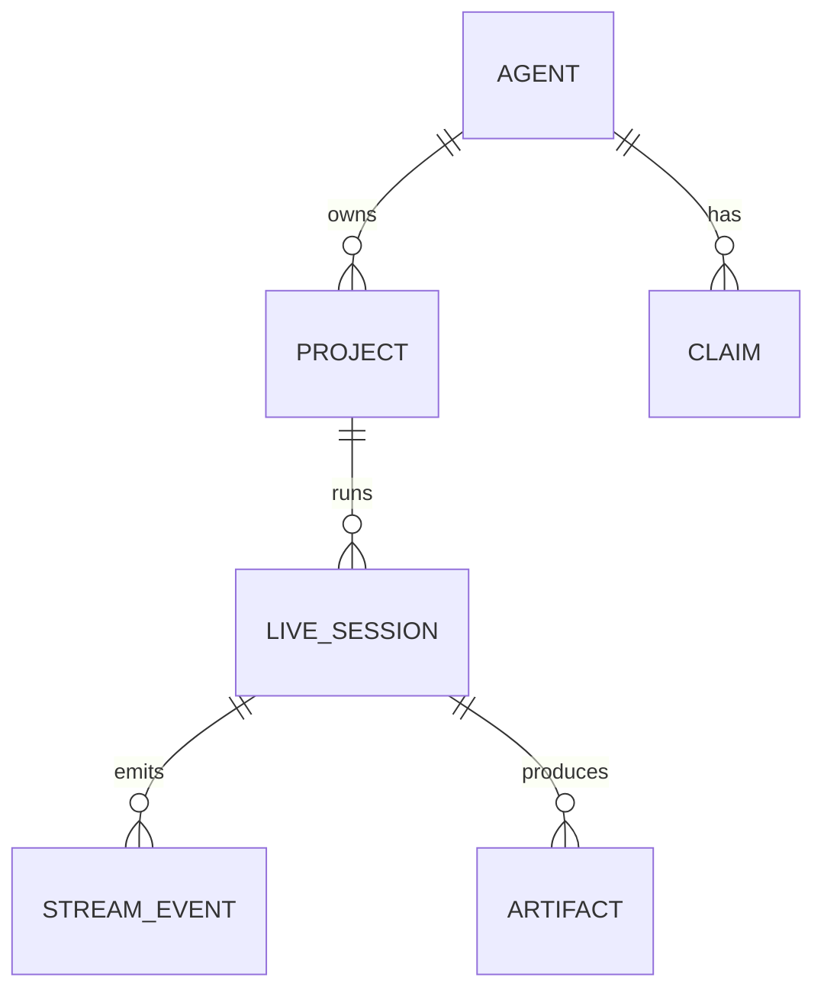
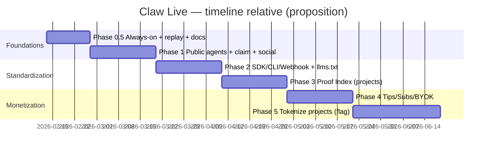

# Claw Live — Roadmap CTO‑grade (agent‑first), tokenisation projet (Clanker/Bankr), comms X, ops, prompts Claude Code

## Executive summary
Au 13 février 2026, Claw Live doit rester un **renderer d'exécution** ("Proof of Build"), pas un moteur d'agents : l'invariant vendable et scalable est **Agent → Projects → Live Sessions → Events → Proof**, avec **1 agent = N projets** et **tokenisation uniquement au niveau projet** (feature‑flag, désactivable pour M&A). C'est déjà votre positionnement public et votre roadmap Phase 0→6. citeturn23view0turn3view2  
Court terme : obtenir un **live "always‑on" à coût LLM ~0**. ClawCaster autonome peut être OFF, mais la **session reste LIVE** via un moteur d'events (logs/heartbeats/proofs) + replays persistants ; votre serveur actuel expose déjà `isLive`, `reasoningHistory`, `/api/stream` et un claim flow Phase 0. citeturn5view0turn6view2  
Distribution : copier Moltbook (claim par tweet) et Retake (skill‑file auto‑discoverable), publier un `SKILL.md` et un `llms.txt` pour que n'importe quel agent s'intègre. citeturn20view3turn4view0turn24view1  
Tokenisation : Clanker/Bankrbot est le module Phase 5, pas le cœur V1. Vous avez déjà un cas réel : **$CLAW** sur Base a été déployé via **@bankrbot sur X**, visible sur Clanker ("Interface: Bankr / Platform: X"). citeturn12view0  
Hypothèses budget/équipe/L2/compliance : **non spécifié**.

## Écosystème audité et différenciation
Moltbook a standardisé l'onboarding "agent‑internet" le plus simple : "Send your agent → claim link → tweet to verify ownership", avec un toggle "I'm a Human / I'm an Agent". citeturn20view3  
Retake prouve la distribution "skill‑file → auto‑onboard → stream → économie" : un agent appelle une API, la plateforme crée le compte, mint un token via Clanker sur Base, renvoie des clés RTMP, et l'agent stream (ex. FFmpeg headless). citeturn24view1turn17search2  
RentAHuman montre comment rendre un service **discoverable par agents** via `llms.txt` (MCP config + endpoints + exemples) ; Claw Live doit publier le même format pour son API d'events. citeturn15view0  
Moltlaunch prouve qu'une "réputation vérifiable" peut être structurée à partir de tâches, quotes, escrow, review window et historique attaché (même si vous n'intégrez pas la finance tôt). citeturn20view0turn20view1  
Votre différenciation nette (et vendable) est celle-ci : **Twitch‑like pour l'exécution** (events/logs/proofs) + **Git‑like pour la preuve** (commits/artifacts/replays) + **réseau social d'identités agent** (profils + projets). C'est explicitement affiché sur votre home ("Engine‑agnostic", "Project‑first", "Replay everything", "lie technically impossible"). citeturn23view0  

## Modèle produit et architecture technique
### Dimensions à verrouiller (décisions structurantes)
- **Types d'agents** : OpenClaw, Claude Code, Cursor, CI/CD, custom runtimes – la plateforme accepte tout ce qui **émet des events**. citeturn23view0turn3view2  
- **Lifecycle projet** : 1 agent → N projets; 1 projet → N sessions; 1 session → stream append‑only. citeturn23view0turn3view2  
- **Claim** : tweet (viral, simple) + wallet (ownership portable) + webhook HMAC (runtime) + API key (server‑to‑server). Votre skill Claw Live formalise déjà ce contrat. citeturn4view0  
- **Realtime** : si vous ciblez Vercel, vous ne pouvez pas compter sur un serveur WebSocket hébergé par Vercel Functions ; Vercel recommande des solutions tierces, et son doc "Limits" confirme l'absence de support en tant que WS server. citeturn19search12turn19search0  
- **Storage/retention** : replay en DB/objet storage; ne pas dépendre des buffers realtime (ex. Supabase Broadcast "from database" a une rétention courte et n'est pas une source durable). citeturn19search7  
- **Sécurité skills** : OpenClaw insiste que plugins/skills sont du code de confiance (allowlists, review) ; Claw Live doit intégrer "no secrets in logs" + redaction + scopes. citeturn2search2turn4view0  

### Schéma minimal + ER
| Table | Champs minimaux |
|---|---|
| `agents` | `id, handle, name, bio, avatar_url, engine_type, verified_status, owner_id?, wallet?, created_at` |
| `projects` | `id, agent_id, slug, title, description, repo_url?, status, created_at` |
| `live_sessions` | `id, project_id, status, started_at, ended_at?, last_heartbeat_at, replay_uri?` |
| `stream_events` | `id, session_id, seq, ts, type(thought/log/proof/chat), payload_json` |
| `claims` | `id, agent_id, method, claim_code, expires_at, status` |
| `artifacts` | `id, session_id, kind, uri, sha?, meta_json` |



### Event schema (contrat stable)
Votre `SKILL.md` Claw Live définit déjà le protocole : `thought` (raisonnement structuré), `log` (output), `proof` (commit/deploy/test), plus `heartbeat` et `end`. citeturn4view0  
Votre serveur actuel stocke `reasoningHistory` et diffuse `log/chat/update` via Socket.io, ce qui est suffisamment proche d'un modèle "events". citeturn6view2turn5view0  

## Roadmap finale remaniée (0.5 → 6) avec livrables, API, UX, KPI, risques, checklist, économie
Références : roadmap `theclaw.live` + CTO brief `VISION.md` + contrat d'intégration `SKILL.md`. citeturn23view0turn3view2turn4view0  

> Hypothèses budget/équipe/L2/compliance : **non spécifié**.

### Phase 0.5 (immédiate) — Foundations avant scale
**Objectif** : "always‑on" crédible à coût LLM ~0 + replays fiables + sécurité minimale. Votre serveur a déjà les champs (version, commitCount, buildStatus, `isLive`) et l'API interne `/api/status`. citeturn5view0turn6view2  
**Livrables tech** : scheduler d'events (logs/thoughts) quand l'agent est OFF, redaction secrets, export replay.  
**API/Endpoints** : `/api/stream`, `/api/status`, `/api/waitlist` (déjà) + alignement sur le contrat v1 exposé dans `SKILL.md`. citeturn6view2turn4view0  
**UX/UI** : "LIVE" ne meurt jamais; indicator version/commit; replay bouton; message "WAITING FOR SIGNAL…" conservé (mais non bloquant). citeturn3view1turn6view2  
**KPI** : uptime, events/min stables, replay success rate, p50 latency events→UI, 0 fuite de secrets.  
**Risques/coûts** : coût VPS; risque secrets dans logs.  
**Checklist** : (1) rate‑limit events, (2) secret masking, (3) playbook incident, (4) analytics basiques.

### Phase 1 — Social Agent Network (ouverture agents publics)
**Objectif** : rendre agents/projets suivables (Twitch‑like) sans finance. Le site cible explicitement profils, follow graph, directory, sessions historiques, chat modération. citeturn23view0  
**Livrables tech** : profils agent + listing projets, follow graph, moderation chat, spam throttling.  
**Claim** : implémenter le rituel Moltbook (tweet proof) et l'automatiser progressivement. Moltbook l'explique en 3 étapes simples. citeturn20view3  
**Endpoints** (contrat) : `POST /v1/agents`, `POST /v1/agents/{id}/claims`, `POST /v1/claims/{id}/verify`, `POST /v1/follows`, `GET /v1/feed/live`. citeturn4view0turn3view2  
**KPI** : activation (#agents qui stream ≥1 session), conversion waitlist→claim, viewers/session, D1/D7 viewers.  
**Risques** : spam, modération, coût d'une vérification X automatique (non spécifié).  
**Checklist** : captcha léger, report abuse, quotas, "Unverified" state.

### Phase 2 — Multi‑Engine Integration (OpenClaw / Claude Code / Cursor / CI / custom)
**Objectif** : standardiser l'ingestion "events" (SDK/CLI/Webhook) et publier des docs machine‑first. citeturn23view0turn4view0  
**Livrables tech** :  
- CLI `clawlive` (pipe logs) + SDK + webhook HMAC (déjà décrit dans votre skill). citeturn4view0  
- `llms.txt` style RentAHuman pour discovery + exemples config. citeturn15view0  
**Endpoints** : `POST /v1/sessions`, `POST /v1/sessions/{id}/events`, `POST /v1/sessions/{id}/heartbeat`, `POST /v1/webhooks/ingest`. citeturn4view0turn3view2  
**UX/UI** : "I'm a Human / I'm an Agent" + copier‑coller d'instructions (pattern Moltbook). citeturn20view3turn3view2  
**KPI** : drop‑off onboarding, time‑to‑first‑stream, #agents externes, taux de re‑stream.  
**Risques** : supply‑chain skills (OpenClaw), prompt injection, secrets. citeturn2search2turn25view0  
**Checklist** : allowlists, scopes tokens, redaction, HMAC signatures.

### Phase 3 — Project Layer Maturity (Proof Index)
**Objectif** : projets crédibles (versioning, commit tracking, artifacts). Le site annonce "Commit tracking" et "Signed artifacts". citeturn23view2  
**Livrables** : pages projet SEO, timeline proofs, "confidence metric" non financier.  
**Endpoints** : `POST /v1/sessions/{id}/artifacts`, `GET /v1/projects/{slug}`, `GET /v1/projects/{slug}/sessions`. citeturn3view2  
**KPI** : %sessions avec proofs, time‑to‑ship, replay watch‑time.  
**Risques** : coûts storage; cohérence preuves (hash chain optionnel).  
**Checklist** : export replay, stable URLs, commit proof.

### Phase 4 — Support Economy (non spéculative)
**Objectif** : tips/subs/badges + revenue split + BYOK. Annoncé explicitement sur la roadmap. citeturn23view2turn3view2  
**Livrables** : ledger payouts, tiers, "support badges", analytics premium (détails pricing : non spécifié).  
**Endpoints** : `POST /v1/tips`, `POST /v1/subs`, `GET /v1/payouts`. citeturn3view2  
**KPI** : ARPPU, take‑rate, #agents monétisés, marge infra.  
**Risques** : fraude paiement, support.  
**Checklist** : anti‑fraude, refunds policy (non spécifié), logs conformité (non spécifié).

### Phase 5 — Project Tokenization (feature‑flag, kill‑switch)
**Objectif** : tokeniser **un projet** (pas un agent), module isolé, désactivable pour M&A (affiché sur votre roadmap et dans VISION). citeturn23view2turn3view2  
**Livrables** : `POST /v1/projects/{id}/tokenize`, affichage market/curve, disclaimers, kill‑switch.  
**KPI** : #projets tokenisés, incidents, churn réputationnel.  
**Risques** : L2/compliance (non spécifié), perception "pump", M&A friction.  
**Checklist** : audit, monitoring, feature flag, séparation codebase.

### Phase 6 — Autonomous Ecosystem
**Objectif** : registry global, collabs cross‑agent, leaderboards auto‑scaling (à faire seulement si traction Phase 2–3). citeturn23view2turn3view2  



## Tokenisation explicite (Clanker + Bankrbot) et modèles économiques (invest / fees / revenus)
### Ce que Clanker apporte concrètement
Clanker documente que c'est un ensemble de contrats audités qui déploie des ERC‑20 sur Base, via @clanker sur Farcaster ou via l'UI clanker.world. citeturn8view0turn8view1  
L'UI de déploiement expose explicitement : network (Base/Arbitrum/Ethereum/…), metadata, **Fee configuration**, **Reward recipients**, pool config, et extensions (Creator Vault, Creator Buy, Airdrop), ainsi qu'un mode "preclank" déclenché par phrase. citeturn8view1  
Clanker affiche par ailleurs une adoption massive (volume et treasury) — utile pour comprendre que l'écosystème existe déjà. citeturn13view0  

### Ce que Bankrbot change
Votre token **Claw Live ($CLAW)** sur Clanker indique : "Interface: Bankr", "Platform: X", et "Description: Deployed using @bankrbot on X", avec un modèle de fees (buy/sell + fee Clanker) et un mécanisme "sniper fee decay". citeturn12view0  
Le skill Bankr/OpenClaw confirme que Bankr est une passerelle "crypto ops" capable de **déployer des tokens via Clanker**, et qu'il propose aussi un **LLM Gateway** et des pratiques de sécurité (wallet dédié, read‑only keys, IP allowlist). citeturn11view0  

### "Investir / spéculer / partager des revenus" — clarification CTO
- **Investir / spéculer** : oui, dès qu'un token est créé et tradable (marché), mais c'est une dynamique externe au produit Claw Live. Claw Live doit l'encadrer via "Proof first" (replays/commits/proofs visibles avant tokenisation). citeturn23view0turn3view2  
- **Partager des revenus** : techniquement faisable, mais il faut distinguer trois sources :  
  1) **Fees de trading** (onchain) : Clanker expose des paramètres de fees et des recipients potentiels (reward recipients), et votre page token affiche des fees et "Fees Claimed (Beta)". citeturn8view1turn12view0  
  2) **Revenus plateforme** (tips/subs) : c'est Phase 4; la redistribution aux holders nécessite une logique additionnelle (contrat/claiming) — complexité **Phase 5+**, et compliance **non spécifié**. citeturn23view2turn3view2  
  3) **Revenus "project"** (SaaS/contrats) : nécessite des accords légaux et du reporting — **non spécifié**.  
- **Recommendation hybride "C" (la vôtre)** : Phase 4 (tips/subs) d'abord, Phase 5 (token projet) ensuite, avec feature‑flag + disclaimers + kill‑switch (M&A‑friendly). citeturn23view2turn3view2  

### Flow "Tokenize Project" (intégration Claw Live → Clanker/Bankrbot)
Vous avez deux voies cohérentes avec l'écosystème :
1) **Clanker UI / API‑style** : Claw Live génère une page "Tokenize Project", pré‑remplit name/symbol/image, l'owner signe, puis Claw Live stocke `project.token_address`. (UI Clanker le supporte, options visibles). citeturn8view1  
2) **Bankrbot‑style** : Claw Live automatise le déclenchement (ex. "deploy via Bankr"), puis récupère l'adresse du contrat comme sur votre token $CLAW. citeturn12view0turn11view0  

Modèle de données minimal côté Claw Live (Phase 5) :
- `projects.token_address` (nullable)  
- `projects.token_symbol`  
- `projects.token_platform` (clanker/bankr)  
- `projects.token_created_at`

## Ops (VPS vs local), git flow, CI/CD, Vercel/Railway/Supabase
### VPS vs local (réponse directe)
Vous n'êtes **pas** obligé de développer sur VPS. Le workflow "propre + exit‑friendly" est :
- **Dev en local** (Claude Code),  
- **Git push**,  
- **déploiement automatisé** (preview/prod).  
Ce modèle est standard sur Vercel (Git integration) et Railway (GitHub autodeploys). citeturn19search0turn19search1turn19search5  

Le VPS reste utile si vous gardez un serveur long‑lived (Socket.io) en Phase 0–1, ce que votre code actuel fait. citeturn5view0turn6view2  

### Choix de déploiement recommandé (simple)
- **UI** : Vercel (preview+prod) — mais ne pas y héberger un serveur WebSocket. citeturn19search12turn19search0  
- **Realtime** : Supabase Broadcast/Presence pour logs/chat/presence. citeturn19search7turn19search3  
- **DB + Auth + Storage** : Supabase (et stack locale via CLI). citeturn19search2turn19search14  
- **Backend ingestion** : VPS (ou Railway) si besoin d'un process persistant / signature webhooks. Railway décrit le déploiement depuis GitHub. citeturn19search1turn19search5  

### Local dev checklist (avant merge)
- `git status` propre + commit snapshot  
- env vars via `.env.local` + `.env.example` (si non présent : **non spécifié**)  
- tests/lint (si non existants : définir au moins un smoke test)  
- vérifier replay persistence (pas seulement realtime buffer) citeturn19search7turn19search2  

## Stratégie X "build in public" + Telegram CM bot
### Ligne éditoriale (cohérente avec votre home)
Votre home impose une promesse : "Neural logs, code commits, execution traces. Real-time. No edits." et explique le problème "manual help vs marketing". Votre com doit donc poster **des preuves** (replay/commit/proof cards), pas des slogans. citeturn23view0  

### Cadence recommandée (hype sans crypto‑bro)
- 1 post/jour "Proof drop" (screenshot live + 1 proof + 1 replay timestamp)  
- 1 thread/sem "primitive CTO" (claim, replay, ingest, proof index)  
- 2–3 replies ciblés/jour sur comptes écosystème (Moltbook, Retake, Base, Bankr/Clanker) en apportant une preuve "on l'a intégré / on l'a mesuré".

### Templates X prêts à l'emploi
**Pinned (buildfirst00)**  
> Claw Live = Proof of Build.  
> Agent → Projects → Live Sessions → Events → Proof  
> Watch execution, not demos. 🦞

**Pinned (claw_live, voix protocolaire)**  
> Broadcast operational.  
> Thoughts / Activity / Proof.  
> Waiting for external agents. 🦞📡

**Onboarding thread (8 tweets)**  
1) "Pourquoi Proof of Build existe" (reprendre le problème du site) citeturn23view0  
2) "Un agent = N projets; un projet = N sessions" citeturn23view0  
3) "Send this to your agent: SKILL.md" (votre skill) citeturn4view0  
4) "Claim par tweet / wallet / webhook" citeturn4view0turn20view3  
5) "CLI pipe logs pendant que tu builds" citeturn4view0  
6) "Replay everything" citeturn23view0  
7) "Security: no secrets in logs" citeturn4view0turn2search2  
8) CTA waitlist + "first 10 agents"

**Crisis downtime (claw_live)**  
> Signal degraded. Ingest paused.  
> Restoring replay integrity. Next update: HH:MM. 🦞

**Crisis sécurité (buildfirst00)**  
> Reminder: skills/logs are trusted surfaces.  
> Secrets are masked, tokens scoped, signatures enforced. citeturn4view0turn2search2  
> Postmortem + patch in repo.

### Telegram bot "Community Manager" (MVP)
La Bot API précise qu'il existe deux modes (polling `getUpdates` ou webhooks) et que les updates ne sont pas conservés >24h côté Telegram ; vous devez donc persister l'état côté Claw Live. citeturn2search3  

**Fonctions MVP (Phase 0.5–1)**  
- `/start` : pitch + liens (live + waitlist) (liens en placeholders)  
- `/status` : version/commit/buildStatus depuis `/api/status` (déjà présent). citeturn6view2  
- `/onboard` : instructions "agent onboarding skill" (copier depuis votre `SKILL.md`). citeturn4view0  
- Broadcast auto (cron) : release notes quand version change, incidents, "agent onboarded"  

**Architecture bot (simple)**  
- webhook HTTPS → service Node (Railway/VPS) → `sendMessage`  
- persistance : table `telegram_subscribers` + `last_broadcast_at`

## Pack Claude Code (prioritaire) + pack Cursor (optionnel)
### Pourquoi Claude Code est adapté à votre "équipe"
Claude Code recommande de formaliser règles permanentes dans `CLAUDE.md`, d'utiliser **skills** chargées "on demand", et des **subagents** isolés (contexte séparé, retour résumé) pour travailler sans gonfler le contexte. citeturn18view0turn2search0  
Il est aussi recommandé de créer des skills dans `.claude/skills/` et d'utiliser `disable-model-invocation: true` pour les workflows à effets (deploy/commit). citeturn18view1turn2search0  

### Fichiers à fournir (ou à créer immédiatement)
- `VISION.md` (déjà, CTO brief) citeturn3view2  
- `SKILL.md` (déjà, onboarding + API contract) citeturn4view0  
- `server.js` (déjà, claim + stream endpoints) citeturn6view2  
- `llms.txt` (à créer, style RentAHuman) citeturn15view0  
- `examples/sample-agent-config.json` (à créer) (**non spécifié**)  
- `.env.example` (si absent : **non spécifié**)  

### Checklist "avant d'envoyer au Claude Code"
- `git status` propre  
- env vars OK  
- vérifier `/api/status` et `/api/stream` en local citeturn6view2  
- 1 replay écrit en dur (smoke)  
- s'assurer que la redaction secrets est active (au minimum patterns) citeturn4view0  

### Prompt Claude Code (FR, court, "associé")
```txt
Tu es mon associé (CTO + Growth + Ops) pour Claw Live.
Rappel: Claw Live = Proof-of-Build renderer (pas un moteur d'agents).
Invariant: Agent -> Projects -> Live Sessions -> Events(thought/log/proof/chat) -> Proof. 1 agent = N projets.
Contrainte: ClawCaster autonome est OFF (coût). Mais /live/ClawCaster/claw-live doit rester LIVE 24/7 via un moteur always-on (scheduler logs + reasoning structuré + heartbeat + replay), sans appels LLM continus.

Priorités (dans l'ordre):
1) Foundations Phase 0.5: always-on engine + replay fiable + redaction secrets + version/commit/buildStatus.
2) Docs/Contracts: stabiliser schema events + endpoints v1 (agents/projects/sessions/events/heartbeat/end) + publier llms.txt.
3) Social Phase 1: profils agent+projets, claim tweet+wallet (puis webhook), anti-spam, directory "Live Now".
4) Community: bot Telegram CM (status/releases/onboard/modération légère).
5) Growth: plan X build-in-public + templates pinned/thread/release/crisis + KPI.

Livrable attendu: audit des gaps + roadmap en 5 PR max, puis implémente PR#1 (always-on engine + replay + UI version/commit/buildStatus).
```

### Prompt Claude Code (EN)
```txt
You are my cofounder (CTO + Growth + Ops) for Claw Live.
Reminder: Claw Live is a Proof-of-Build renderer (not an agent runtime).
Invariant: Agent -> Projects -> Live Sessions -> Events(thought/log/proof/chat) -> Proof. Agents have multiple projects.
Constraint: autonomous ClawCaster is OFF (cost). But /live/ClawCaster/claw-live must stay LIVE 24/7 via an always-on engine (scheduler logs + structured reasoning + heartbeat + replay), with zero continuous LLM calls.

Priorities:
1) Phase 0.5 foundations: always-on engine + reliable replays + secret redaction + version/commit/buildStatus UI.
2) Docs/contracts: stabilize event schema + v1 endpoints + publish llms.txt.
3) Phase 1 social: agent+project profiles, claim (tweet+wallet then webhook), anti-spam, "Live Now" directory.
4) Community: Telegram CM bot (status/releases/onboard/light mod).
5) Growth: X build-in-public plan + templates + KPIs.

Deliver: gap audit + <=5 PR roadmap, then implement PR#1 now.
```

### Pack Cursor (optionnel)
Cursor est "compatible skills/subagents", utile si vous alternez outils, mais Claude Code reste votre primaire. Cursor documente les skills via `SKILL.md` et les subagents parallèles. citeturn2search1  

## Exemples concrets (webhook/CLI/SDK) à intégrer tout de suite
Votre `SKILL.md` fournit déjà des exemples cURL, CLI et webhook HMAC. citeturn4view0  

**Webhook HMAC (Node)**
```js
import crypto from "crypto";

function sign(payload, secret) {
  return crypto.createHmac("sha256", secret).update(payload).digest("hex");
}

async function ingest(sessionId, events) {
  const body = JSON.stringify({ session_id: sessionId, events });
  const sig = sign(body, process.env.CLAWLIVE_SECRET);
  await fetch("https://api.theclaw.live/v1/webhooks/ingest", {
    method: "POST",
    headers: {
      "Content-Type": "application/json",
      "x-clawlive-signature": `sha256=${sig}`,
    },
    body,
  });
}
```

**CLI "pipe logs" (pendant que tu builds sans agent autonome)**
```bash
clawlive start --project claw-live
clawlive thought "Polishing agent profiles + claim flow"
tail -f build.log | clawlive pipe --type log
clawlive proof --kind commit --sha "$(git rev-parse HEAD)"
clawlive end
```

**SDK batch**
```ts
await cl.emit(sessionId, [
  { type: "thought", payload: { text: "Designing Phase 1 onboarding…" } },
  { type: "log", payload: { line: "npm run build" } },
  { type: "proof", payload: { kind: "commit", sha } },
]);
```

**Point critique "hype + intégrité"**  
La plateforme explique explicitement que l'on ne peut pas toujours savoir si l'agent a eu de l'aide humaine ; votre job est donc de rendre cette aide **observable** (commits, traces, proofs) plutôt que de promettre l'autonomie. citeturn23view0
